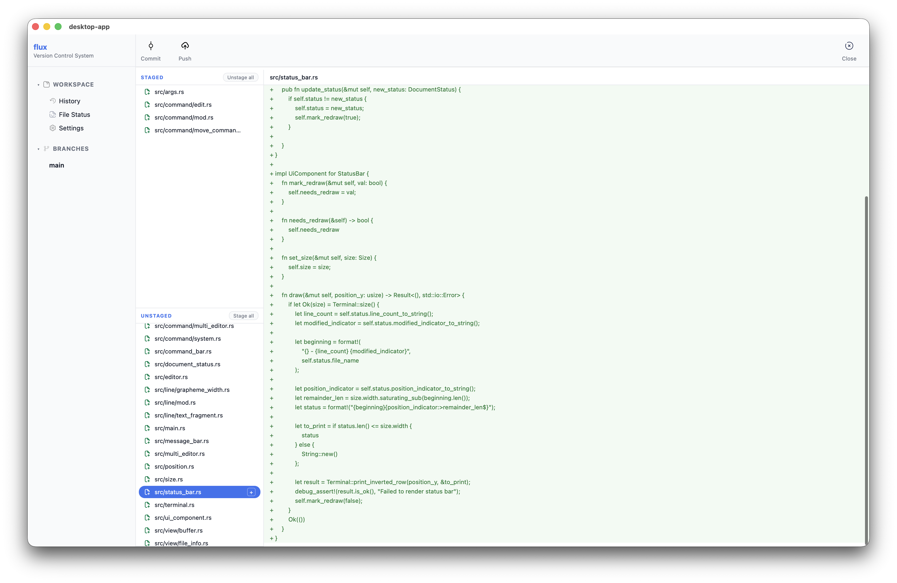

# Flux

### Controlul versiunilor simplificat

Flux este un sistem distribuit de control al versiunilor conceput pentru a oferi funcționalități similare cu Git pentru proiecte mici și medii printr-o interfață simplă și intuitivă.

Proiectul este alcătuit din două componente principale: **Client** și **Server**.

 ## Client

Suportă operații locale precum calcularea hashing-ul fișierelor, stocarea obiectelor, actualizarea indexului, crearea de commit-uri și gestionarea branch-urilor (creare, schimbare și ștergere). Acesta include și un client gRPC care implementează comenzile de bază `clone` și `push`.

## Server

Primește și procesează cererile venite de la client prin intermediul bibliotecii comune proto, care definește serviciile și mesajele utilizate pentru comunicarea dintre client și server. Serverul gestionează autentificarea utilizatorilor și se ocupă de salvarea și organizarea repository-urilor pe disk, oferind acces securizat la acestea pe baza credențialelor primite de la client.

Proiectul include și un fișier `justfile` cu cele mai utilizate comenzi pentru compilare, verificare și rulare.

# Dependențe

Pentru compilarea și rularea proiectului sunt necesare:

* Rust (toolchain stabil)
* Cargo
* Protocol Buffers (`protoc`)
* Just

# Rulare locală

1. Clonează repository-ul:

```bash
git clone "https://github.com/Balcus/flux.git"
cd flux
```

2. Compilează proiectul:

```bash
just build
```

3. Pornește serverul:

```bash
just server
```

4. Într-un alt terminal, pornește clientul desktop:

```bash
just desktop
```

# Comenzi suportate

### Porcelain

* **`add`**
* **`branch`**
* **`clone`**
* **`commit`**
* **`delete`**
* **`diff`**
* **`init`**
* **`log`**
* **`push`**
* **`reset`**
* **`restore`**
* **`set`**
* **`status`**

---

### Plumbing

* **`restore-fs`**
* **`cat-file`**
* **`hash-object`**
* **`commit-tree`**
